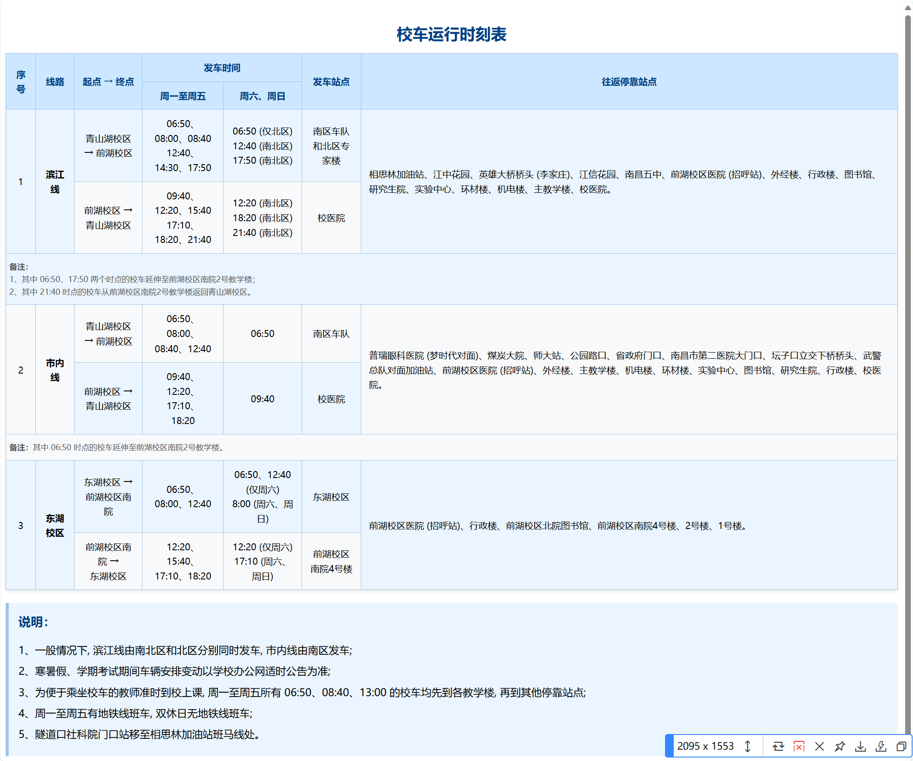

# 校内出行

## 校园环游车

环游车分为两大类，一类长得像巴士，但是内部构造和公交车差不多；另一类则较为小巧，被同学们称为"宝宝巴士"。

如果想要乘坐环游车，可以到固定的站点去等待停靠。当然，如果**在路上恰好碰到，可以"招手即停"，下车的位置也可以"随叫随听"。**

- **运行时间**：发车时间约在 07:00~21:30，发车间隔高峰时段为 6 分钟/班，平峰时段为 12 分钟/班。
- **收费**：0.9 元/次，可以使用支付宝"出行"界面开通"洪城一卡通"付费，或者扫车上二维码付款。

:::tip
校车轨迹可以在 https://school-map.ncuos.com/ 中查看
:::

### 路线一：长途车（天健→医学院往返）

放置标有"天健→医学院（往返）"的**蓝色**牌子：

前湖北院白帆运动场 → 五四大道 → 天健园 → 前湖北院5号门 → 前湖南院 → 前湖南院商业街（然后原路返回）

### 路线二：短途车（天健→白帆往返）

放置标有"天健→白帆（往返）"的**红色**牌子，**短途车不前往医学院！**

前湖北院白帆运动场 → 五四大道 → 天健园

"宝宝巴士"也只在北院行驶，路程比巴士短，为校医院——天健园。

## 青桔单车

通过**滴滴出行 App、滴滴青桔小程序、微信二维码（确定定位准确）或支付宝**扫码使用。

- **收费**：单次骑行 1.4 元/30分钟，月卡 6.9 元/月（无限次骑行）
- **注意**：要在规定的停放点停车，校园专享车不允许骑出校外，否则会收取调度费。

## 跨校区交通

主要通过校园公交车进行校区间通勤，具体时刻表请关注学校通知。

