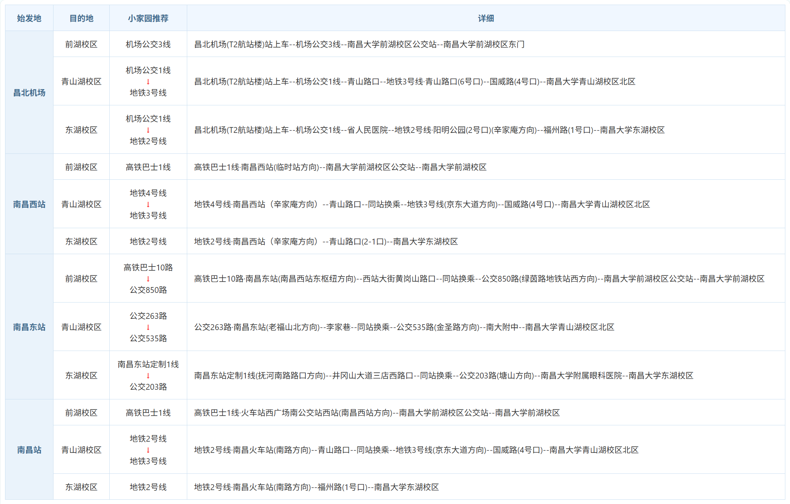

# 校外交通

## 导航

首先要确定好自己的校区在哪个位置，千万别走错了！

### 前湖校区

- 如果你住在**修贤**，推荐导航终点为"南昌大学北区-前湖大道门"
- 如果住在**天健或者医学院**，推荐导航终点为"南昌大学北区-北门"

### 青山湖校区

导航至"南昌大学青山湖校区"即可。

### 东湖校区

导航至"南昌大学东湖校区"即可。

## 新生到校交通

新生从各个车站下车后，推荐选择学校在南昌西站、南昌站、南昌东站专门的巴士到校区。

