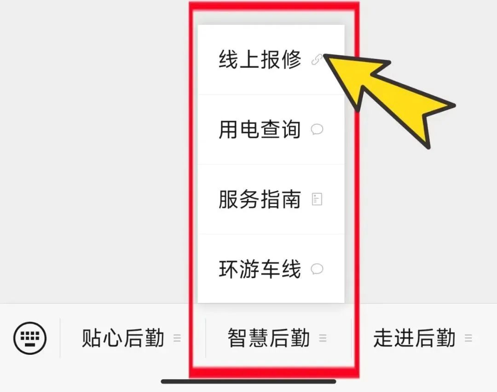

# 报修指南

> 学校报修效率还是可以的，而且免费。~~如果觉得灯暗、风扇转速慢可以悄悄弄坏~~

## 什么可以报修？

宿舍内任何门窗、桌椅、水电设施故障，以及宿舍楼栋的卫生间等公共设施故障，都可以报修。

## 如何报修？

关注**【南昌大学后勤】微信公众号**，点击【智慧后勤】中的【线上报修】。

然后清晰描述具体报修区域、设施以及故障情况，维修工作人员会在 48 小时内上门查看并维修。

:::note
为确保新生寝室设施报修流程顺畅、高效，便于维修人员优先处理新生需求，在提交报修时，请在"报修设施"类别中准确勾选**"2025级新生寝室设施"**。
:::

:::tip
宿舍报修维修项目，木工、水工、电工都不收取任何费用。

特别提醒：卫生间门锁坏了直接报修"门坏了"，报"锁坏了"就不是物业师傅维修范围，就要收取费用了。

若防盗门钥匙断在里面了，需要专业师傅来维修，更换锁芯、锁体等就要收取费用。
:::
