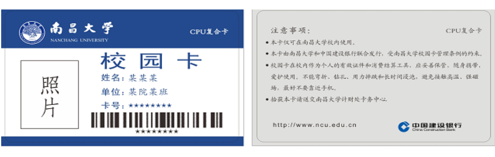

# NCU 校园卡简介

:::tip
写给新生：首先，"校园卡"是一张由学校统一发放的【不收费】的蓝色卡片；其次，所谓的需要办理的"校园卡"可能是要求校园身份的电话卡/套餐，凡是与钱有关的，都请持谨慎态度，三思三思再三思。
:::

## 校园卡说明

为方便广大师生员工的工作、学习和生活，学校采用"校园一卡通"系统。目前系统在各个校区实现的功能主要有**就餐、图书借阅、购电、就医、乘车、运动健身等**功能。校园卡既可以作为电子支付工具，又可以作为校内个人身份证明。

系统密码包括"消费密码"和"查询密码"。密码均为 6 位，初始为身份证号后 6 位。身份证号中的"X"在密码中作为 0。在系统中没有登记身份证号的校园卡，其密码为"000000"。领卡后可自行修改。

新生校园卡卡号与学号一致，本科生 10 位，研究生 12 位。卡上已按各省考试院（高招办）提供的电子照片印制个人照片。少数缺失照片的同学，新卡卡面将没有照片显示。

:::note
现在校园卡基本没有用处，一切用手机就都可以解决，学生证会比校园卡用处多一点。
:::

## 校园卡挂失及解挂

如遗失校园卡，请尽快到自助大厅内的自助机或领款机上自行挂失，或凭有效身份证明到校园卡服务中心办理挂失。挂失操作将在 24 小时后生效。挂失 24 小时后可持有效证件到校园卡服务中心补发新卡。

如果找到了遗失的校园卡，在未补办新卡之前可持老卡及有效身份证明到校园卡服务中心解挂，解挂立即生效。

## 卡有效期

校园卡根据持卡人学制情况规定有效期。本科生有效期通常为 4 年（少数专业为 5 年），硕士研究生为 3 年，博士研究生为 5 年。超期校园卡将被注销。

如因休学或其它原因要延长学习时间，请本人携带相关材料持卡提前到校园卡服务中心调整所在班级。

出于对校园卡的安全考虑，系统会对超过 180 天不使用的卡做禁用处理，如需启用，可持校园卡在食堂任意一台显示"联机"标识的消费终端上靠 5 秒，当显示"Login-OH"时，表示可以正常使用。

在本校继续攻读更高学位或毕业留校的学生，因学号、身份变化，须与其它学生一样，离校时办理退卡注销手续。学校会按新身份发放新卡。
