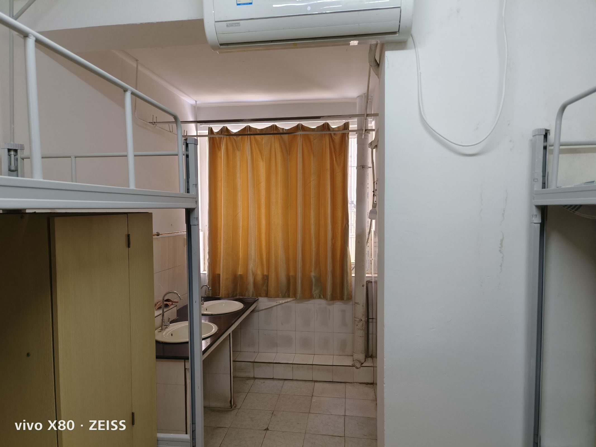
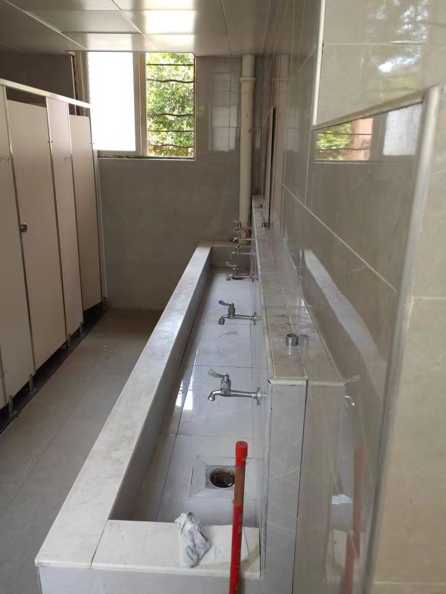
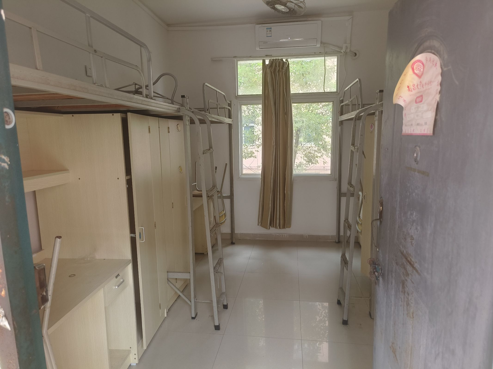
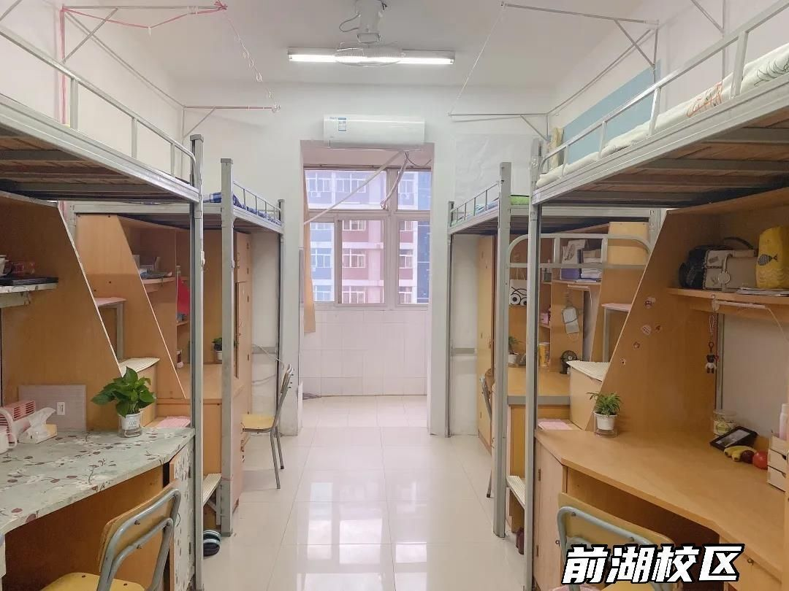
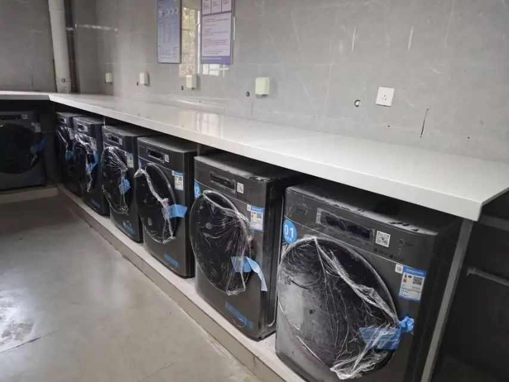
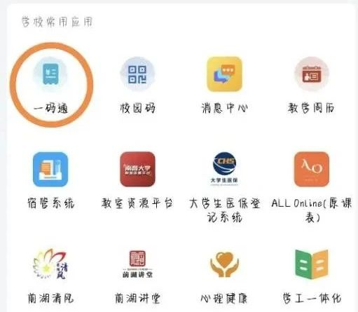

# 寝室生活

## 宿舍状况

### 独立卫浴

除医学院有独立卫浴，前湖其余宿舍楼均为每层 2-4 个公共卫生间。

:::warning
前湖校区修贤 1-4 栋宿舍内没有洗手池。洗手、刷牙、洗水果、洗衣物，全都要去公共卫生间。其他楼栋宿舍内是有洗手池的，宿舍设施还可以。
:::

### 上床下桌

- 前湖都是四人寝、上床下桌。但 1-4 栋是爬梯式上铺，其他楼栋则是楼梯式上铺。楼梯式挺好的，爬梯式非常陡！
- 青山湖校区五人寝，上床下桌。

### 床铺数据

- 床铺：2m × 0.9m
- 内长：1.95m × 0.85m
- 凉席建议：1.9m × 0.9m
- 床距离天花板约：1.1 ~ 1.3m
- 床帘建议尺寸：1.9 × 0.9 × 1.1

## 智慧洗衣房

每一栋宿舍楼都配有洗衣房，或是在楼层有洗衣区。

### 使用流程

1. 下载 U净 APP
2. 扫描机身二维码
3. 自由选择洗衣模式
4. 手机支付
5. 实时查询洗衣进度
6. 接收完工提醒

### 价格

| 设备名称 | 洗涤程序 | 收费价格 | 洗涤容量 |
| --- | --- | --- | --- |
| **滚筒洗衣机** | 单脱水 | 0.1 元/桶 | 至多 1/3 桶 |
| | 快洗 | 2.3 元/桶 | 适合 1/2 桶 |
| | 标准洗 | 2.8 元/桶 | 适合 2/3 桶 |
| | 大物洗 | 3.5 元/桶 | 适合 3/4 桶 |
| **烘干机** | 低温烘 | 0.5 元/10分钟 | 时间可选 |
| | 中温烘 | 0.8 元/10分钟 | 时间可选 |
| | 高温烘 | 0.9 元/10分钟 | 时间可选 |
| | 羽绒服烘 | 1.0 元/10分钟 | 时间可选 |
| **洗鞋机** | 标准洗 | 2.5 元/次 | 2-3 双鞋 |
| | 单脱水 | 0.1 元/次 | 2-3 双鞋 |

:::warning
不要把你的私人贴身衣物放到洗衣机，不然宿舍群将会留下关于你的妙语连珠。
:::

## 宿舍规章制度

### 断电时间

- 周日至周四：23:00 — 次日 6:00
- 周五至周六：0:00 — 次日 6:00

### 断电范围

- 熄灯和插座断开
- 网络 WLAN 断开情况不一
- 空调、电风扇、饮水机不受影响
- 本部的走廊、卫生间不断电
- 医学部的卫生间不断电

:::tip
当你发现自己宿舍在十一点之后没有熄灯的话，请不要声张，爱来自学长学姐~

熄灯后，宿舍的灯要及时关闭喔，不然第二天早上亮灯后容易被灯光照醒。
:::

### 功率限制

单个用电设备功率不可以超过 800W。

## 热水服务

### 热水供应时间

- **开水器供应时间**：06:00 - 00:00
- **直饮水供应时间**：全天
- **淋浴热水供应时间**：
  - 早上：06:30 - 08:00
  - 中午：12:00 - 14:00
  - 晚上：17:00 - 00:00

### 使用方式

- **微信小程序"一合物联"**：宿舍内部的直饮水，扫描饮水机上的二维码便可获取。
- **云闪付小程序"一合智慧校园"**：用于获取洗澡的热水，用手机蓝牙连接控制，洗澡时扫码支付即可使用热水。也可以选择办理水卡，插卡即可用水。

### 收费标准

- 淋浴热水计费：0.047 元/升
- 开水计费：0.1 元/升
- 宿舍直饮水计费：0.32 元/升

:::tip
夏天的南昌会很热，洗冷水澡是完全没有问题的。如果没有洗冷水澡的习惯，除了在淋浴间洗，还可以选择办游泳卡。
:::

## 故障报修

室内外设施等需维修时，可通过"南昌大学后勤"公众号 →**"智能报修"** 进行报修。

详见 [报修指南](./repair.md)。

## 权益服务

权益问题可通过"南昌大学学生会"公众号 →**"香樟权益"** 进行反馈。

## 电费

### 查看电费

推荐使用南大家园，点击 生活 → 电量查询，即可快捷直观查看宿舍电费使用情况。

### 充值电费

**线上充值（推荐）**：打开企业微信 → 选择一码通 → 点击宿舍缴电费即可。

**线下充值**：
1. 进入建行 APP → 点击"悦享生活" → "校园卡充值"即可
2. 激活：到各食堂一楼店家处询问并进行激活即可
3. 领款：可在食堂或宿舍楼下领款机进行
4. 充电：可在宿舍楼下智能充电机上操作

:::note
校园卡初始密码为身份证后六位（最后一个数为 X 时用数字 0 代替）。第一次使用需要激活，半年不用也需要补激活。
:::
