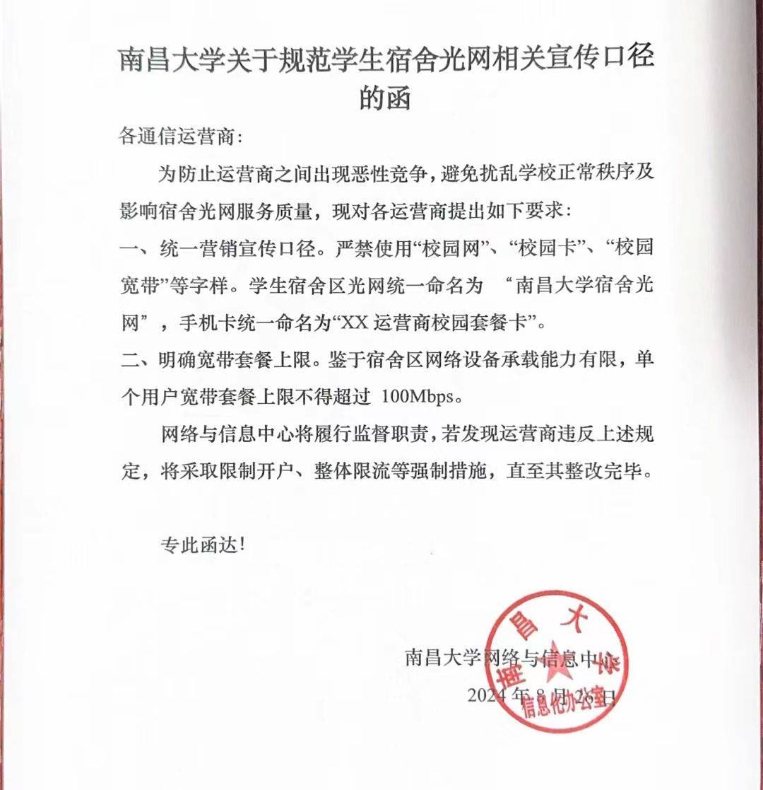
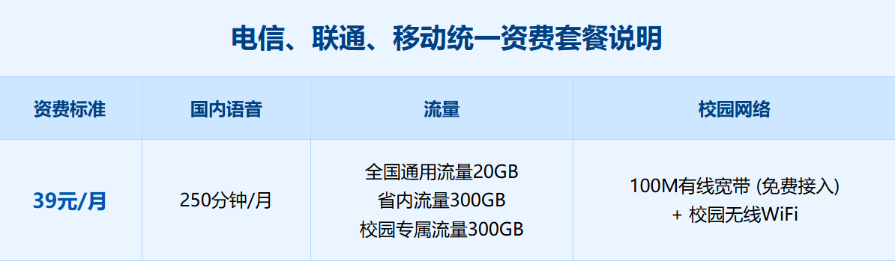

# 网络与流量卡（"校园卡"）

## 关于网络

### 教学办公区网络服务

我校在教学办公区提供**免费网络服务**，首次使用前需访问**"数畅南大"门户系统 http://my.ncu.edu.cn** 激活账号，并设置密码。

新生在校园教学办公区，可通过 WiFi 连接名称为 **"NCUWLAN"** 的开放无线网，或通过教室、实验室、图书馆自习室等有线网络端口接入校园网，连通后将自动弹出 Web 浏览器登录页面，**用户名为学号，密码与综合服务门户密码一致。** 登录成功后即可访问互联网。

若 Web 浏览器未自动弹出登录页面，可在浏览器地址栏中手工输入 **http://aaa.ncu.edu.cn** 登录页面验证。

### 宿舍区网络服务

在宿舍楼没有**免费**的 NCUWLAN 了，要想连 WiFi 只有运营商维持的 NCU-5G 和 NCU-2.4G 或者寝室 WiFi（寝室装个路由器就可以办理了），这些网络都是百兆网。同时也可以在办理校园电话卡的时候要求师傅给你拉网线，这样网速会快一点。

:::danger
千万不要用 NCUWLAN 或者校园网干一些坏事，你在学校的网络中心眼里和裸奔没什么区别
:::

## 校园电话卡

开学如果想要办理电话卡，前湖校区的同学可以在商业街的移动、电信、联通的营业厅处办理；青山湖校区同学可以在 9 栋宿舍楼下进行线下办理，或者直接拨打电话让工作人员上门办理。

:::warning
不建议跨校区办理电话卡，不同校区可能不太愿意给你处理售后服务。
:::

### 校园卡 ≠ 校园电话卡

很多售卖校园电话卡的推销人员，刻意把"校园电话卡"说成"校园卡"，目的就是让完全陌生的新生在听到"校园卡"这个词后，以为这是每个人都必须要办理的。

**校园卡和校园电话卡完完全全是两个东西！！！**

- **校园卡**：相当于南昌大学在校学生的电子身份 ID，是在开学后每个人都会分发的！
- **校园电话卡**：当你手机卡的流量无法满足你在校园的使用强度时，可以考虑购买。购买的同时会赠送运营商专属的校园网账号，可以在宿舍使用 NCU-5G 和 NCU-2.4G 的校园网络。（注意一个账号只能同时登录两个设备）

校园卡的详细介绍在这里：[NCU校园卡简介](./campus-card.md)

### 校园电话卡怎么办理

校园电话卡办理需单独办理一个新号码。和普通办理电话卡不同的是，校园电话卡办理时需要填写学号用于身份绑定。后续会用这个新办理的校园电话卡的手机号码，给你开通一个用于登录运营商无线网络和有线网络的网络账号。在电信，你可以同时登陆一台电脑和两个手机/平板，其他两家应该也差不多。

### 套餐内容

三家的套餐内容和价格都差不多。**需要注意的是，校园电话卡有合约期，一般一年到两年不等（到期会涨价，比如涨价成 128 一个月）。** 一般的做法是合约期到了就去营业厅注销然后重新办理一张校园电话卡。同时由于合约期的限制大家最好保留老号码。

江西本省的同学可以拨打 **电信 10000 / 移动 10086 / 联通 10010**，转人工服务给自己的老号码办理 **8 元保号套餐**。外省同学视流量情况决定是否需要转保号套餐。

大概月租 39 元，套餐内容一般是（每年会有小变化）：通话 + 流量 + 校园网账号。

:::tip
可以和室友商量一起办同一个运营商的电话卡。只需要一起买一个路由器（100-200 元）就可以让营业厅帮你们安装寝室 WiFi。寝室 WiFi 比校园网要来的稳定，同时寝室 WiFi 也是需要网络账号来登录的。网线可自己买也可营业厅买，营业厅售价为 1 米 1 元，路由器推荐自己去网上购买，营业厅的型号有些老了。
:::

### 我到底要不要办这个校园电话卡

- 日常对流量需求大又喜欢宅在寝室的人，这个校园电话卡的套餐还算优惠。**值得一办 ✔️**
- 玩在线多人竞技电脑游戏，需要网络稳定，最好是有线网络。**值得一办 ✔️**
- 平常不出门用不到那么多流量，同时是外省的。原先的电话卡流量够用，那这个校园电话卡就比较鸡肋。**不需要办 ❌**
- 一天到晚泡教学楼、图书馆自习。有教学楼公共 WiFi 对流量需求不大。**不需要办 ❌**
