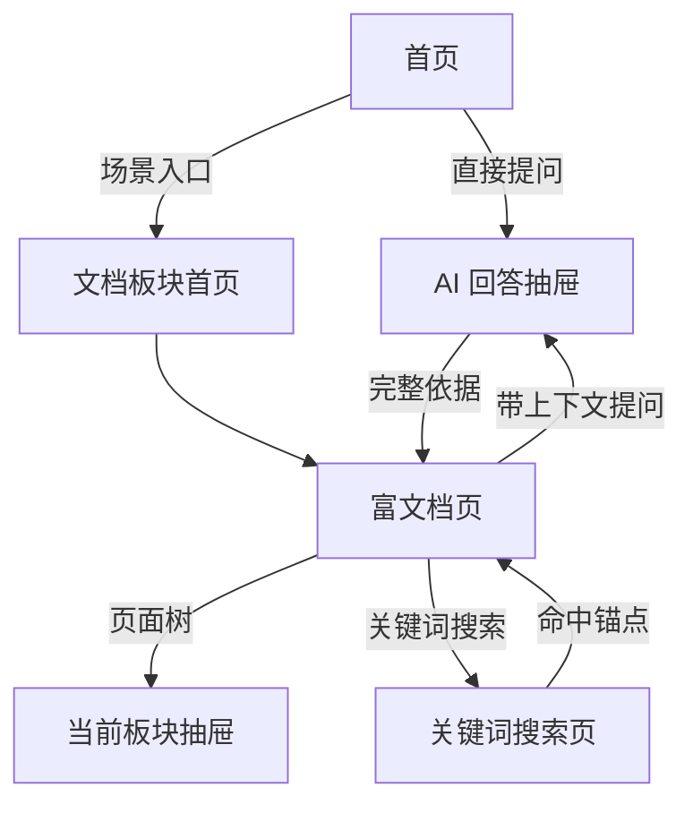

# Design：移动端 AI 知识产品重构

状态：草案。未经 `approval.md` 的人类批准，严禁实现。

## 技术方向

- `mobile-web/` 是唯一学生端 Next.js 产品前端；Docusaurus 只保留为只读迁移来源，直至 `T3.4` 全部验收。未获单独批准，禁止删除 Docusaurus 页面、路由或内容。
- 保留现有 API、评测、反馈与运营能力；重构不重写已验证的后端能力。
- Notion 同步产出站内 page、block-tree、asset、anchor 和 search-index 数据；不以 Markdown 作为发布中间表示。
- 使用 CSS 设计令牌、Tailwind v4 theme tokens、Lucide 和无样式可访问 primitives 构建设计系统。

## 发布与回滚边界

- 新学生端先使用独立预览地址和内容快照验收；不得直接替换现有公开站入口。
- 生产切换需要：首批内容快照通过、R1-R6 验收通过、人工视觉基线批准、回滚到现有 Docusaurus 的运行说明。
- 每次发布数据变化保留最近一次成功 `contentVersion`；同步或部署异常时学生端回退到该版本。

## 页面关系

## 内容渲染

- `ArticleRenderer` 接收结构化块树并按块类型渲染。
- 每个标题和可引用段落具有稳定锚点。
- `ColumnsBlock` 在手机按逻辑阅读顺序堆叠；`TableBlock` 可水平滚动；资源由站内存储提供。
- AI 检索使用由标题/段落切出的文本和元数据，不改变人读文章；引用、低置信和返回行为遵循 `docs/product/answer-evidence-contract.md`。

## 视觉实施

- 先实现设计令牌与基础组件，再实现页面。
- 先实现 390px 样张，之后验证 360px 与 430px；桌面为增强布局。
- 不启用未经批准的全量主题库；交互 primitives 与视觉组件分离。

## 失败与降级

- 没有搜索命中时，只显示无结果与检索建议，不生成答案。
- AI 无可靠来源时，明确说明资料不足并引导查看相关文档/反馈。
- 嵌入资源加载失败时，展示来源、标题和明确的外部打开路径。
- Notion 同步失败时，继续展示最近一次成功发布版本并标记维护端状态。
