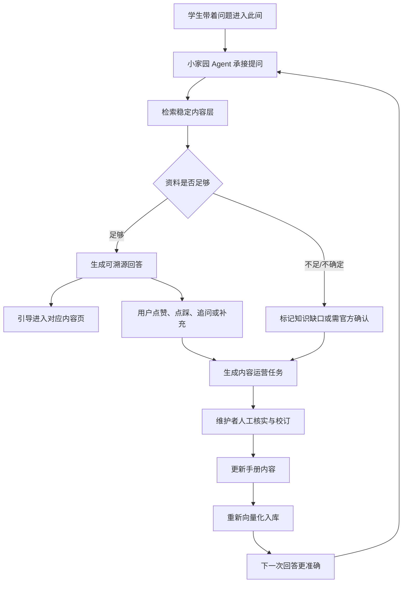

# 此间 × 小家园 Agent 统一产品定义 v2

日期：2026-04-22

项目：ncubook / 此间 / 小家园 Agent

用途：统一产品定位、视觉方向、Agent 叙事和求职作品集表达，避免“人文内容站”和“AI Agent 项目”两条线分裂。

## 1. 一句话定义

`此间` 是面向南昌大学学生的校园信息入口，帮助具体的人理解校园规则、找到可靠内容，并通过 `小家园 Agent` 把真实提问转化为知识库持续更新的线索。

更短版本：

> 此间是学生端的信息入口，小家园 Agent 是背后的知识运营引擎。

作品集版本：

> 基于南昌大学校园手册构建的 AI 知识运营系统：学生通过小家园获得可溯源回答，维护者通过 Agent 发现内容缺口、生成运营任务，并推动知识库持续迭代。

## 2. 品牌主张

主品牌：

> 此间

归属表达：

> 此间 by 南大家园

核心主张：

> 让信息回到真实，也回到人。

这句话不能只作为情绪化 slogan，它对应的是产品判断：

- 不只堆资料，而是解释资料对具体的人意味着什么。
- 不只让用户搜索，而是承接用户真实问题。
- 不只让 AI 回答一次，而是让问题反向推动内容变好。
- 不只追求权威感，而是承认校园信息中存在经验、变化和缺口。

## 3. 产品立场

此间站在具体的人这一边，而不是站在通知和系统这一边。

具体意味着：

- 信息组织要接近人的问题，而不是接近部门目录。
- 回答要解释“该怎么做”，而不是只复述“文件怎么写”。
- 资料不足时要承认不确定，而不是用 AI 编造完整答案。
- 用户发现不准时，应该能低门槛补充或反馈。
- 内容不是一次性发布物，而是会随着真实使用被校订、补白和回流。

## 4. 产品不是什麼

此间不是：

- 只追求“最全”的校园资料站。
- 蓝白模板式知识库。
- 只有 AI 问答、没有内容骨架的聊天壳。
- 代替学校官方通知的发布器。
- 站内论坛或热闹社区。
- 赛博、炫技、发光的 AI 工具站。
- 自动改写和发布内容的全自动 Agent。

小家园 Agent 也不是：

- 无边界的万能校园助手。
- 替代教务、后勤、学院或官方部门的决策系统。
- 可以自动发布政策、费用、资格、处分、成绩等敏感内容的系统。

## 5. 产品结构

此间的产品结构由四层组成：

### 5.1 学生端入口层

学生进入此间时，通常不是为了浏览完整目录，而是带着一个具体或模糊的问题。

入口包括：

- 首页 AI 提问框
- 文档页小家园 AI 助手
- 站内搜索
- 频道入口
- 此刻 / 校订与补白入口

这一层的职责：

- 让用户先被接住。
- 让用户不用先懂信息架构。
- 将问题导向回答、内容或反馈。

### 5.2 稳定内容层

稳定内容是此间的底盘。

当前最重要的底座频道：

- 学业与流程
- 生活与办事

它们承接长期高频问题，例如：

- 学分绩点
- 选课考试
- 转专业
- 校园卡
- 校园网
- 报修
- 常用电话
- 交通与宿舍

这一层的职责：

- 提供可被引用的内容来源。
- 让 AI 回答有根据。
- 让用户能离开聊天，进入结构化页面继续阅读。

### 5.3 动态与共创层

此间不做站内重社区，但需要承接变化中的信息。

动态入口：

- `此刻正在发生的`

它不是论坛，而是动态策展入口。职责是承接近期变化、经验线索、需要关注的校园议题，并把更实时的讨论导向南大家园 app 圈子。

共创入口：

- `校订与补白`

它不是简单报错表单，而是修订、补充、标注和留下校园线索的参与路径。

这一层的职责：

- 承认校园信息会变化。
- 给用户低门槛参与入口。
- 为知识运营 Agent 提供反馈和线索来源。

### 5.4 Agent 运营层

小家园 Agent 是背后的知识运营引擎。

它做的不只是回答问题，还包括：

- 记录用户真实问题。
- 判断知识库是否覆盖该问题。
- 在资料不足时标记内容缺口。
- 对敏感问题提示人工或官方确认。
- 生成内容补全任务。
- 帮维护者判断更新优先级。
- 通过 eval 和指标持续评估回答质量。

这一层的职责：

- 让学生提问不只服务当前用户，也成为知识库迭代的输入。
- 让维护者知道哪里该补、哪里过时、哪里需要核实。
- 把“内容共创”从情怀变成可运营的流程。

## 6. 核心闭环

此间 × 小家园 Agent 的长期价值来自以下闭环：

这条闭环对应一句话：

> 问题进入，内容承接，反馈归因，校订补白，再学习。

## 7. 首页定位

首页不是目录页，也不是功能说明书。

首页是一张有立场的分发页。

首页顺序保持：

1. Hero
2. AI 提问区
3. 两个精选频道入口
4. 此刻正在发生的
5. 校订与补白

### 7.1 Hero

Hero 的职责：

- 让人记住名字。
- 让人感受到立场。

Hero 文案：

> 此间
>
> 让信息回到真实，也回到人。

Hero 不承担完整功能解释，不堆按钮，不写成 AI 产品宣传页。

### 7.2 AI 提问区

AI 提问区是首页第一功能入口。

推荐表达：

> 不知道从哪里开始，就先问小家园。

辅助说明可以非常克制：

> 它会先回答，也会把缺失的信息带回给维护者。

这一句是新旧定位的关键连接点：既保留“先问”，也把 Agent 的知识运营价值埋进去。

### 7.3 频道入口

频道入口只保留少而准的稳定底座，不重新铺成目录。

推荐两个入口：

- 学业与流程
- 生活与办事

不要退回到“学业 / 生活”这种过泛表达，也不要堆太多卡片。

### 7.4 此刻正在发生的

此刻不是站内论坛，也不应写得像假社区 feed。

推荐语言：

- 最近变化
- 经验线索
- 待核实
- 来自圈子的讨论
- 已回流为手册内容

避免：

- `Community / 12 min ago`
- `8 COMMENTS`
- `HOT`
- 看起来像没有真实数据支撑的实时社区。

### 7.5 校订与补白

校订与补白要承担知识运营闭环的显性表达。

它应该让用户明白：

- 信息不准可以被修正。
- 手册缺失可以被补充。
- 用户问题可以变成维护线索。
- AI 不是自动发布者，维护者仍会人工审核。

推荐表达方向：

> 每一次提问、点踩和补充，都会帮助此间更接近真实。

## 8. AI 助手定位

小家园 AI 助手不应被设计成“另一个聊天产品”，而应是此间的入口和路由器。

它的回答风格：

- 简短
- 可溯源
- 不装懂
- 能推荐页面
- 能提示官方确认
- 能引导补充

它的产品职责：

- 回答已有资料覆盖的问题。
- 把用户带到真实内容里。
- 在资料不足时标记缺口。
- 把低质量回答和用户点踩转成运营线索。

它不应该：

- 生成一篇看似权威的完整页面。
- 没有来源还下结论。
- 把所有问题都回答成“建议咨询官方”。
- 让用户停留在聊天里，而不进入内容。

## 9. 运营后台定位

运营后台不属于学生端主站视觉体系。

学生端应保持克制、人文、现代、低噪声。

运营后台可以更接近：

- Linear
- Supabase
- Agent Ops Console

后台服务的是维护者和作品集展示，重点是：

- Query Log
- Gap Task
- Coverage Status
- Eval Report
- Failure Analysis
- 内容缺口关闭情况

它可以更数据化、更冷静、更像 AI 产品后台，但不应反过来污染学生端主站。

## 10. 视觉方向

### 10.1 认可方向

当前应坚持：

- 克制
- 现代
- 黑白基底
- 充足留白
- 少量灰绿或低饱和点缀色
- 内容先于装饰
- 视觉可以冷，态度不能冷
- 轻微磨砂 / 玻璃层次可以使用，但不能炫技

### 10.2 已否决方向

不要再回到：

- 蓝白知识库模板
- 土黄旧报纸
- 星图 / 节点网络 Hero
- 赛博发光
- 大量粒子、噪声、动效
- AI 工具站式渐变
- 后台 Dashboard 风首页

### 10.3 当前首页的修正方向

不是推翻原来的 Editorial Minimalism，而是做产品显影：

- 保留 `此间` 的大标题和留白。
- 让 AI 提问区更明确是“小家园”入口。
- 把 “学业 / 生活”升级为 “学业与流程 / 生活与办事”。
- 把假社区感动态改成动态策展语言。
- 把校订与补白和 Agent 缺口识别闭环接上。

## 11. 求职作品集叙事

这个项目不应包装成单纯“做了一个 AI 问答机器人”。

推荐叙事：

> 我先基于真实校园信息差构建了 `此间`，让学生可以从问题进入稳定内容；随后将小家园 AI 从 RAG 问答升级为知识运营 Agent，通过问题日志、缺口识别、运营任务和 eval 指标，让学生提问反向驱动知识库持续更新。

对应能力：

- AI 产品判断：知道什么时候 AI 只是入口，什么时候内容才是底盘。
- Agent 行为设计：定义回答、拒答、缺口识别和人工审核边界。
- 产品运营能力：把用户反馈转成内容任务和指标。
- 信息架构能力：把静态文档、动态信息和共创入口分层组织。
- 风险意识：敏感问题不自动发布、不替代官方、不无来源下结论。

简历版本：

> 设计并开发南昌大学校园信息产品 `此间` 与知识运营 Agent `小家园`。项目以校园手册为内容底盘，提供可溯源 AI 问答，并设计问题日志、内容缺口识别、用户反馈归因、运营任务生成和 eval 指标，形成“提问、回答、反馈、补全、再学习”的知识库迭代闭环。

## 12. 后续实现优先级

### 12.1 视觉与首页

优先做：

- 修正首页文案，使 AI 入口更明确。
- 将精选入口改为 “学业与流程 / 生活与办事”。
- 重写 `此刻正在发生的` mock 数据，去掉假社区感。
- 重写 `校订与补白`，显性表达知识回流。
- 保持原有黑白克制风格，不重做成蓝白 docs。

### 12.2 Agent 产品闭环

按开发计划推进：

- Query Log
- Gap Detector
- Ops Task Generator
- Dashboard
- Eval Set

### 12.3 作品集

输出：

- PRD
- 开发计划
- 统一产品定义
- 一页 Case Study
- 3 分钟 Demo 脚本
- 首页与 Agent 后台截图

## 13. 判断标准

后续所有页面、文案和功能设计都用以下问题检查：

- 它是否让信息更接近具体的人？
- 它是否让用户更容易从问题进入内容？
- 它是否避免把 AI 做成没有内容底盘的聊天壳？
- 它是否让反馈、补白和修订更容易发生？
- 它是否尊重官方信息和人工审核边界？
- 它是否保持克制，而不是变成炫技页面？
- 它是否能服务求职叙事，而不是只满足视觉好看？

如果答案是否定的，就说明设计方向又开始漂了。

