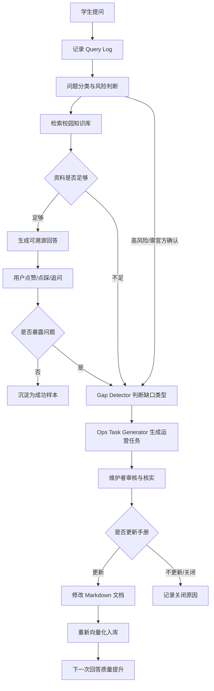

# 小家园知识运营 Agent PRD v1

日期：2026-04-22

项目：ncubook / 南昌大学生存手册

定位：面向校园信息服务的 AI 知识运营系统

## 1. 产品摘要

小家园知识运营 Agent 是基于南昌大学生存手册构建的 AI 产品升级方案。它不只面向学生提供可溯源问答，也面向内容维护者发现知识库缺口、归因问题来源、生成内容补全任务，并通过人工审核推动手册持续更新。

当前 ncubook 已具备校园知识库、RAG 问答助手、页面反馈和 AI 回答反馈能力。v1 的目标是在现有基础上补齐“运营闭环”：让学生真实提问反向驱动知识库变好，形成“提问、回答、反馈、缺口识别、任务生成、人工审核、文档更新、重新入库”的循环。

本项目适合作为 AI 产品实习、Agent 产品经理、产品运营岗位的作品集案例，重点展示产品判断、Agent 行为设计、人机协同、内容运营指标和评测体系，而不是单纯展示模型调用能力。

## 2. 背景与问题

南昌大学学生在入学、学习、生活、发展过程中会遇到大量碎片化问题，例如校园卡、校园网、绩点、转专业、宿舍、食堂、报修、交通、竞赛、考研等。这些信息分散在学校通知、学长学姐经验、公众号、群聊和手册文章中，常见问题包括：

- 学生不知道信息在哪里，搜索成本高。
- 新生不了解学校流程，容易在群聊中重复提问。
- 手册维护者不知道哪些内容最需要补充。
- 页面内容可能过时，但缺少系统化反馈入口。
- AI 问答能临时回答问题，但如果不沉淀反馈，知识库不会持续变好。

因此，产品问题不是“要不要加一个聊天机器人”，而是：

如何把学生的真实提问变成知识库迭代的输入，让 AI 同时服务学生查询和内容运营？

## 3. 目标用户

### 3.1 学生用户

主要包括南昌大学新生、低年级学生、准备办理校园事务的在校生。

核心需求：

- 快速得到校园问题答案。
- 答案要有来源，不希望被 AI 编造误导。
- 不知道如何描述问题时，希望 AI 能引导继续提问。
- 没找到答案时，希望有人知道这个问题需要补充。

### 3.2 内容维护者 / 产品运营者

主要包括 ncubook 维护者、学生组织运营成员、内容贡献者。

核心需求：

- 知道用户真实在问什么。
- 识别哪些页面内容缺失、过时或不清楚。
- 将分散反馈转成可处理的内容任务。
- 判断内容更新优先级。
- 评估 AI 助手是否真的提升了信息获取效率。

## 4. 产品目标

### 4.1 用户侧目标

- 降低学生查找校园信息的成本。
- 提供可溯源、可追问、边界清晰的校园问答体验。
- 在资料不足时诚实告知，并引导反馈或官方渠道确认。

### 4.2 运营侧目标

- 将用户问题结构化记录为可分析数据。
- 自动识别知识库缺口和内容过时风险。
- 为维护者生成内容补全任务和草稿大纲。
- 建立内容质量指标，指导后续运营迭代。

### 4.3 求职展示目标

- 展示从真实场景出发定义 AI 产品的能力。
- 展示 Agent 行为边界、任务流、人工审核和评测指标设计。
- 展示产品运营视角：反馈收集、内容供给、用户问题分析和迭代闭环。

### 4.4 为什么是 Agent 而不是普通 chatbot

普通 chatbot 的主要价值是回答当前用户的问题，但 ncubook 的核心矛盾不只是“当下能不能答”，还包括“手册能不能因为用户提问而持续变好”。因此，小家园不应只被设计成对话入口，而应被设计成能参与知识运营流程的 Agent。

Agent 相比普通 chatbot 的增量价值：

- 能判断问题是否被知识库覆盖，而不是只生成回答。
- 能在资料不足时承认缺口，而不是用模糊话术补齐。
- 能把用户提问转成运营任务，推动后续内容补全。
- 能识别高风险问题并要求人工或官方渠道确认。
- 能沉淀日志、反馈和 eval 结果，为内容运营提供数据依据。

换句话说，学生端看到的是“问答助手”，维护者端得到的是“知识库运营助手”。这也是本项目从 RAG 问答升级为知识运营 Agent 的关键差异。

## 5. 非目标

v1 不做以下事情：

- 不自动发布或修改正式手册内容。
- 不替代学校官方通知、教务系统或后勤系统。
- 不处理涉及个人隐私、账号、成绩、处分等敏感个人事务。
- 不构建复杂多 Agent 架构。
- 不追求“万能校园助手”，只聚焦校园信息查询和知识库运营。

## 6. 核心用户旅程

### 6.1 学生提问并获得可靠回答

1. 学生在首页搜索框、文档页悬浮按钮或站内搜索无结果时发起提问。
2. Agent 记录问题、当前页面、时间和入口来源。
3. Agent 对问题进行分类，例如入学、学业、生活、发展、贡献反馈。
4. Agent 检索知识库并获取相关文档片段。
5. 如果资料充分，Agent 生成简洁回答，并附带来源链接。
6. 学生可以继续追问、跳转来源页面、点赞或点踩回答。

### 6.2 学生问题暴露知识缺口

1. 学生提问后，Agent 未检索到高相关资料，或回答被用户点踩。
2. Agent 将该问题标记为潜在内容缺口。
3. Agent 判断缺口类型：未覆盖、部分覆盖、信息过时、问题模糊、需要官方确认。
4. Agent 推荐应补充的页面或建议新建页面。
5. 系统生成一条运营任务，供维护者审核。

### 6.3 维护者处理内容任务

1. 维护者进入运营看板，查看待处理任务。
2. 每条任务展示用户原问题、相关页面、缺口判断、推荐优先级和补充大纲。
3. 维护者核实信息来源后，决定更新现有页面、新建页面、关闭任务或标记为需官方确认。
4. 文档更新后重新运行入库脚本，使新内容进入检索库。
5. 相似问题再次出现时，Agent 能给出更准确回答。

### 6.4 Workflow Map

## 7. MVP 范围

v1 只要求跑通最小闭环，不追求复杂自动化。

### 7.1 Query Log 问题日志

记录每次 AI 问答的核心信息：

- 用户问题
- 入口来源：首页、文档页、搜索页、AI 快捷问题
- 当前页面路径
- 检索到的文档片段和相似度
- AI 回答文本
- 是否包含来源链接
- 用户反馈：点赞、点踩、未反馈
- 请求耗时
- 模型与 embedding 配置
- 错误信息

### 7.2 Gap Detector 内容缺口判断

对每次问答生成一个覆盖状态：

- `covered`：知识库已有明确资料，回答有来源。
- `partial`：知识库有相关资料，但无法完整回答。
- `missing`：知识库基本没有覆盖。
- `outdated_risk`：资料可能过时，需要维护者核实。
- `official_required`：涉及政策、收费、处分、成绩、资格审核等，需要以官方渠道为准。
- `unclear_query`：用户问题过于模糊，需要追问。

v1 可以先通过规则和 LLM 分类结合实现，不需要训练模型。

### 7.3 Ops Task Generator 运营任务生成器

当问题满足以下任一条件时，生成候选运营任务：

- 检索相似度低。
- 回答没有有效来源。
- 用户点踩回答。
- 多个用户反复提出相似问题。
- Agent 判断为 `missing`、`partial`、`outdated_risk` 或 `official_required`。

任务字段包括：

- 任务标题
- 用户原问题
- 问题分类
- 缺口类型
- 推荐处理方式
- 推荐补充页面
- 建议补充大纲
- 需要核实的信息
- 优先级
- 状态：待处理、处理中、已更新、关闭、需官方确认

### 7.4 运营看板

v1 看板只需要支持维护者判断“先做什么”。

核心模块：

- 高频问题 Top 10
- 点踩问题列表
- 未覆盖问题列表
- 需要官方确认的问题列表
- 待更新页面列表
- 任务状态分布
- AI 回答满意度
- 平均响应耗时

## 8. Agent 行为规范

### 8.1 回答前

Agent 应先判断用户问题是否属于校园信息服务范围。

可以回答：

- 校园生活信息
- 学业流程说明
- 入学准备
- 校园设施与办事路径
- 手册内已有内容的总结、解释和导航

不直接回答或需谨慎回答：

- 个人成绩、账号、隐私、身份认证
- 政策最终解释
- 金钱、处分、资格审核等高风险事项
- 明显与南昌大学校园信息无关的问题

### 8.2 检索时

Agent 应优先基于以下上下文：

- 当前用户正在浏览的页面
- 向量检索得到的高相关文档片段
- 站点结构中的权威页面路径
- 历史高频问题和已关闭任务

如果当前页面与问题相关，应优先利用当前页面内容；如果当前页面无关，应正常进行全站检索。

### 8.3 回答时

Agent 应遵守以下规则：

- 第一句话直接给出核心结论。
- 使用 3 到 5 个要点解释。
- 明确给出信息来源。
- 来源不足时必须说明“不确定”或“手册暂未覆盖”。
- 不编造不存在的校内政策、地点、电话、费用或时间。
- 对敏感事项提示以学校官方通知或相关部门为准。
- 给出 2 到 3 个后续问题，引导用户继续探索。

### 8.4 生成运营任务时

Agent 不应把所有未命中都当成内容缺口。它需要区分：

- 用户表达太模糊，需要追问。
- 问题不属于手册范围。
- 问题属于手册范围但缺少内容。
- 内容存在但表达不清楚。
- 内容可能过时，需要核验。

生成任务时，Agent 只提供建议和草稿，不自动发布。

## 9. 信任边界

本产品采用 human-in-the-loop 机制。

AI 可以做：

- 回答已有资料覆盖的问题。
- 判断内容覆盖状态。
- 聚类相似问题。
- 生成内容补充任务。
- 生成待审核草稿大纲。
- 推荐应更新的页面。

AI 不可以做：

- 自动发布手册正文。
- 自动删除、覆盖已有内容。
- 宣称未经核实的信息为事实。
- 替代学校官方部门给出最终政策解释。
- 处理用户个人隐私或账号数据。

需要人工审核的内容：

- 新增或修改文档正文。
- 涉及政策、收费、资格、处分、成绩、考试的内容。
- 涉及具体地点、电话、时间、流程变更的内容。
- 可能影响大量新生决策的信息。

## 10. 数据与指标

### 10.1 产品指标

- AI 问答使用次数
- 首页搜索转 AI 提问率
- 文档页 AI 唤起率
- AI 回答点赞率
- AI 回答点踩率
- 有来源回答占比
- 无结果问题占比
- 用户追问率

### 10.2 运营指标

- 新增内容任务数
- 有效内容缺口数
- 内容任务关闭率
- 内容缺口平均关闭时间
- 高频问题覆盖率
- 被点踩回答的修复率
- 文档更新后相似问题满意度变化

### 10.3 Agent 指标

- 回答准确率
- 引用命中率
- 缺口识别准确率
- 敏感问题升级准确率
- 平均响应耗时
- 平均 token 成本
- 检索失败率
- 生成失败率

## 11. Eval 设计

v1 准备 50 条校园高频问题作为评测集，覆盖入学、学业、生活、发展、贡献反馈五类。

每条评测数据包含：

- 用户问题
- 问题分类
- 标准答案要点
- 标准来源页面
- 是否允许直接回答
- 是否需要提示官方渠道
- 期望覆盖状态
- 期望是否生成运营任务

示例：

| 用户问题 | 分类 | 期望行为 | 是否生成任务 |
| --- | --- | --- | --- |
| 学分绩点怎么算？ | 学业 | 回答并引用绩点页面 | 否 |
| 转专业需要什么条件？ | 学业 | 回答概览并提示以学院通知为准 | 否 |
| 青山湖校区电动车在哪里充电？ | 生活 | 若手册无资料，标记缺口并生成补充任务 | 是 |
| 我的校园卡丢了怎么办？ | 入学/生活 | 回答补办路径并引用相关页面 | 视覆盖情况 |
| 奖学金什么时候发？ | 学业/发展 | 提示需以官方通知为准，若无资料生成核实任务 | 是 |

评测方式：

- 人工标注标准答案和来源。
- 批量调用 Agent。
- 对比回答是否覆盖标准要点。
- 检查来源页面是否正确。
- 检查是否正确拒答或升级。
- 记录失败原因。

## 12. Failure Analysis 分类

每次失败应归因到具体类型，避免只说“模型不行”。

失败类型：

- `retrieval_miss`：知识库有内容，但检索没命中。
- `knowledge_gap`：知识库确实没有相关内容。
- `stale_content`：知识库内容过时。
- `bad_citation`：回答有引用，但引用页面不支持结论。
- `hallucination`：模型编造信息。
- `over_refusal`：本可以回答，但 Agent 过度拒答。
- `under_escalation`：应该提示官方确认，但 Agent 直接给结论。
- `unclear_answer`：回答太长、太绕或没有直接解决问题。
- `frontend_friction`：入口、反馈或跳转体验影响使用。

每类失败都需要对应改进动作：

- 检索问题：调整切片、相似度阈值、rerank 或 query rewrite。
- 内容缺口：生成运营任务，补充文档。
- 过时内容：增加核验状态和更新时间。
- 幻觉问题：强化引用约束和拒答规则。
- 升级问题：补充敏感问题规则。
- 体验问题：优化入口、按钮文案和反馈路径。

## 13. 页面与功能结构

### 13.1 学生端

- 首页提问入口
- 文档页悬浮 AI 助手
- 搜索无结果转 AI
- AI 回答来源链接
- 快捷追问
- 点赞 / 点踩反馈
- 点踩后补充反馈表单

### 13.2 运营端

- 问题日志列表
- 问题详情页
- 内容缺口列表
- 运营任务详情页
- 任务状态管理
- 高频问题聚类
- 指标看板

### 13.3 内容维护流程

- 从任务进入推荐页面
- 查看 Agent 生成的补充大纲
- 人工核实信息
- 更新 Markdown 文档
- 重新运行入库脚本
- 标记任务已关闭

## 14. 技术方案概览

现有基础：

- Docusaurus 构建校园手册。
- 文档按标题切片后生成 embedding。
- Supabase pgvector 存储文档向量。
- API 根据用户问题检索相关片段。
- DeepSeek 生成回答。
- 前端 AI 助手支持流式响应和反馈。

v1 新增：

- Query Log 数据表。
- Agent Evaluation 数据结构。
- Gap Task 数据表。
- Gap Detector 分类逻辑。
- Ops Task Generator 任务生成逻辑。
- 运营看板页面。
- 批量 eval 脚本。

## 15. 数据表草案

### 15.1 query_logs

- id
- created_at
- user_question
- entry_source
- current_path
- retrieved_documents
- retrieved_similarity
- answer
- answer_has_citation
- latency_ms
- model_name
- feedback
- error_message

### 15.2 gap_tasks

- id
- created_at
- title
- source_query_log_id
- category
- gap_type
- recommended_page
- suggested_outline
- verification_needed
- priority
- status
- assignee
- closed_at

### 15.3 eval_cases

- id
- question
- category
- expected_answer_points
- expected_source_paths
- expected_coverage_status
- should_escalate
- should_create_task

### 15.4 eval_runs

- id
- created_at
- eval_case_id
- actual_answer
- actual_sources
- actual_coverage_status
- actual_task_created
- pass
- failure_type
- notes

## 16. MVP 验收标准

v1 完成的标准：

- 用户每次 AI 提问都能进入 Query Log。
- 至少能识别 `covered`、`partial`、`missing`、`official_required` 四类状态。
- 点踩回答或未覆盖问题能生成候选运营任务。
- 运营看板能展示任务列表和基础指标。
- 至少准备 50 条 eval case。
- 能跑一次批量 eval，并输出准确率、引用命中率、缺口识别准确率。
- 能完成一个端到端 demo：问题未覆盖、生成任务、人工补充、重新入库、再次回答成功。

## 17. Demo 脚本

3 分钟作品集 Demo 推荐流程：

1. 展示 ncubook 首页和小家园 AI 助手入口。
2. 用户提问：“青山湖校区电动车在哪里充电？”
3. Agent 检索后发现资料不足，回答“手册暂未完整收录”，并提示需要核实。
4. 后台 Query Log 记录本次问题、检索结果和覆盖状态。
5. Gap Task 自动生成：“补充青山湖校区电动车充电点信息”。
6. 任务详情展示推荐页面、缺失原因、建议大纲和需核实字段。
7. 维护者审核并补充文档。
8. 重新入库后再次提问，Agent 给出准确回答和来源链接。
9. 展示看板指标：未覆盖问题减少、任务关闭、回答满意度提升。

## 18. 风险与应对

### 18.1 信息真实性风险

风险：AI 编造校园政策或办事流程。

应对：强制引用来源；无来源时标记不确定；敏感问题提示官方确认；人工审核后再发布内容。

### 18.2 运营负担风险

风险：自动生成过多低质量任务，维护者处理不过来。

应对：任务生成设置阈值；相似问题聚类；按频次、点踩率和影响范围排序。

### 18.3 产品叙事风险

风险：被误解为普通 RAG 聊天机器人。

应对：作品集重点展示运营闭环、任务生成、人工审核和 eval，而不是只展示聊天界面。

### 18.4 技术复杂度风险

风险：为了追求 Agent 感引入过重架构。

应对：v1 保持单 Agent + 工具链，先跑通闭环，再考虑多 Agent 或更复杂编排。

## 19. 后续路线图

### v1：知识运营闭环

- Query Log
- Gap Detector
- Ops Task Generator
- 基础运营看板
- Eval Set

### v2：内容共创辅助

- 根据用户反馈生成 Markdown 草稿。
- 自动检查站内链接。
- 自动推荐相关图片、表格或流程图。
- 维护者一键复制到文档。

### v3：主动运营能力

- 每周生成内容运营周报。
- 自动发现长期未更新页面。
- 根据开学季、考试周、转专业季节生成运营提醒。
- 对高频问题生成专题页建议。

### v4：更完整的 Agent 工作流

- 引入状态机或工作流编排。
- 支持任务分派给不同维护者。
- 支持任务 SLA 和关闭原因分析。
- 支持多轮追问收集缺失信息。

## 20. 作品集表达建议

推荐标题：

小家园知识运营 Agent：从学生提问中驱动校园手册迭代

推荐一句话介绍：

基于南昌大学生存手册构建的 AI 知识运营系统，不仅为学生提供可溯源校园问答，还能识别内容缺口、生成运营任务，并通过人工审核推动知识库持续更新。

推荐简历表述：

设计并开发南昌大学校园知识运营 Agent“小家园”，基于校园手册内容构建可溯源问答能力，并设计问题日志、内容缺口识别、用户反馈归因和运营任务生成流程，形成“提问、回答、反馈、补全、再学习”的知识库迭代闭环。项目覆盖 RAG 检索、Agent 行为边界、人工审核机制、内容运营指标和评测集设计。

面试讲述重点：

- 为什么不是普通 chatbot：它服务的是知识库运营闭环。
- 为什么适合 Agent：它能判断覆盖状态、生成任务、推动后续动作。
- 为什么需要人工审核：校园政策和流程信息需要可信边界。
- 如何评估效果：准确率、引用命中率、缺口识别率、任务关闭率和满意度。
